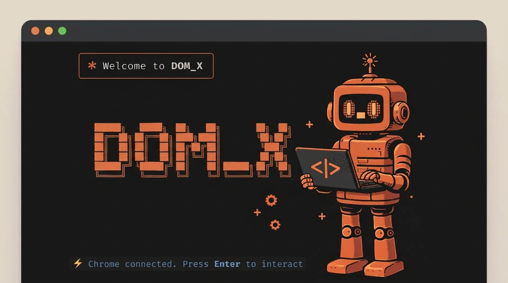

<div align="center">



```text
  ██████╗   ██████╗  ███╗   ███╗     ██╗  ██╗
  ██╔══██╗ ██╔═══██╗ ████╗ ████║     ╚██╗██╔╝
  ██║  ██║ ██║   ██║ ██╔████╔██║      ╚███╔╝ 
  ██║  ██║ ██║   ██║ ██║╚██╔╝██║      ██╔██╗ 
  ██████╔╝ ╚██████╔╝ ██║ ╚═╝ ██║     ██╔╝ ██╗
  ╚═════╝   ╚═════╝  ╚═╝     ╚═╝     ╚═╝  ╚═╝
```

# ⚡ DOM_X
### *Real-Time Browser Perception & Action MCP Server for AI Agents*

[](https://modelcontextprotocol.io)
[-34d399?style=for-the-badge&logo=vitest&logoColor=white)](https://github.com/mysterious03/DOM_X)
[](https://github.com/mysterious03/DOM_X)
[](https://github.com/mysterious03/DOM_X)
[-f43f5e?style=for-the-badge)](https://github.com/mysterious03/DOM_X)

<br/>

<p align="center">
  <b>DOM_X gives AI assistants (Claude Desktop, Cursor, Antigravity, custom agents) real-time perception and precision action control over live browser tabs—replacing expensive screenshot polling with 15ms structured DOM events, screen bounding boxes, and action tags.</b>
</p>

[Quickstart](#-quickstart-for-new-users-3-minutes) • [Benchmark Proof](#-real-world-benchmark-proving-94-token-reduction) • [Interactive CLI](#-interactive-cli--terminal-repl-ollama--claude-code-style) • [AskGemini Assistant](#-built-in-ai--askgemini-assistant) • [All 16 MCP Tools](#-all-16-mcp-tools-reference) • [In-Browser HUD](#-in-browser-visual-hud)

</div>

---

## ⚡ Quickstart for New Users (3 Minutes)

If you are a new developer or user wanting your AI agent (Claude Desktop, Cursor, etc.) to browse and interact with the web, follow these 3 simple steps:

### Prerequisites
* **Node.js**: v18 or higher (`node -v`)
* **Google Chrome**: (or any Chromium browser: Brave, Edge, Arc)

---

### Step 1: Clone and Build DOM_X
Open your terminal and run:
```bash
git clone https://github.com/mysterious03/DOM_X.git
cd DOM_X
npm install
npm run build
npm link
```
> [!TIP]
> Running `npm link` makes the `domx` command globally available in any terminal window. If you prefer not to link, replace `domx` with `node bin/dom-x.js` or `npm run domx --`.

---

### Step 2: Auto-Configure Your AI Assistant
DOM_X provides a 1-command installer that automatically detects your client's config file and injects the DOM_X MCP server:

* **For Claude Desktop:**
  ```bash
  domx install claude
  ```
  *(Restart Claude Desktop after running this).*

* **For Cursor IDE:**
  ```bash
  domx install cursor
  ```

* **For Both:**
  ```bash
  domx install all
  ```

---

### Step 3: Launch Chrome with the DOM_X Plugin (Extension)

#### Option A: Automatic 1-Command Launcher (Easiest)
```bash
domx launch https://github.com
```
*This launches Chrome with an isolated profile and DOM_X pre-loaded, connecting directly to the MCP bridge (`ws://127.0.0.1:8765`).*

#### Option B: Manual Installation in Your Regular Chrome Browser
1. In Chrome, navigate to `chrome://extensions`.
2. Toggle **Developer mode** to **ON** in the top-right corner.
3. Click **Load unpacked** in the top-left corner.
4. Select the `dist/` directory from this project folder (`<PATH_TO_DOM_X>/dist`).
5. Open any real website (e.g. `https://github.com` or `https://google.com`).
6. DOM_X is now active and connected!

> [!WARNING]
> **Got "No browser tab connected to DOM_X"?**
> Chrome security prevents extensions from running on internal pages (`chrome://`, `chrome-extension://`, or blank new tabs).
> **Fix:** Simply open or switch to any real website (e.g., `https://github.com`, `https://google.com`, `http://localhost:3000`), and DOM_X will instantly detect the tab!

---

### Step 4: Talk to Your AI Assistant!
Now, open Claude Desktop or Cursor and ask the AI to interact with your live browser tab:

> **Try these real prompts:**
> * *"Go to news.ycombinator.com and summarize the top 3 stories."*
> * *"Find the login button, click it, type 'octocat' into the username field, and tell me what changed on the screen."*
> * *"Search for 'modelcontextprotocol' on GitHub and list the top 5 repositories."*
> * *"Wait for the checkout button to appear on the page and click it."*

#### What Happens Under the Hood:
1. When you send a prompt, your AI client invokes DOM_X's `get_page_dom` tool via the MCP protocol.
2. DOM_X scans the active browser tab, assigns stable element IDs (`@e1`, `@e2`, `@e3`), draws translucent color-coded HUD bounding boxes in Chrome, and returns a token-efficient summary in **12 milliseconds**.
3. Your AI issues targeted actions (`click_element`, `type_into_element`, `scroll_page`) referencing `@e1`, `@e2`, etc.
4. If a modal opens, toast alert appears, or form validates, DOM_X's **15ms mutation listener** informs the AI immediately—**zero screenshot polling required**.

---

## ⏱️ The Problem in 30 Seconds

Today's autonomous web agents (built on Playwright, Puppeteer, or Browser-Use) understand browser state by **taking continuous full-page screenshots** and feeding them into Vision Models (GPT-4o, Claude 3.5 Sonnet, Gemini 2.0 Flash):

```
Agent Action ──► 4K Screenshot (5MB) ──► Send to VLM ──► Ask "Did button change?" ──► [Repeat every 500ms]
```

### Why this is broken:
* 🐌 **Extreme Latency:** 2,500ms – 4,000ms round-trip delay per action step.
* 💸 **Runaway Cost:** $0.02 – $0.08 per screenshot inspection ($30–$50 per agent workflow).
* 🔋 **Wasted Compute:** Sending millions of static pixels over the wire to detect a 10-pixel button state flip.
* 👁️ **Blind to Semantic State:** Vision models struggle with invisible states like `aria-expanded="false"`, `disabled`, or off-screen modals.

---

## 💡 The Solution: DOM_X

**DOM_X** connects directly to your live Google Chrome browser via the official **Model Context Protocol (MCP)**:

```
Webpage DOM ──► MutationObserver ──► 96% Noise Filter ──► Bounding Boxes ──► 15ms JSON & Actions (MCP)
```

1. **Token-Efficient Perception:** Extracts clean, structured interactive elements with bounding boxes and action IDs (`@e1`, `@e2`, `@e3`...).
2. **15ms Change-Intelligence:** Informs the AI immediately when a toast appears, modal opens, or form validation fires—without taking screenshots.
3. **Full Precision Action Suite:** The AI can click, hover, type, select dropdowns, send keypresses, scroll, and evaluate scripts directly.
4. **Visual HUD:** Renders live bounding box tags directly in your Chrome window so you can watch what the AI sees in real time.
5. **One-Command CLI:** Installs into Claude Desktop or Cursor and launches Chrome with one command.

---

## 📊 Real-World Benchmark: Proving 94%+ Token Reduction & 200x Speedup

To empirically demonstrate how DOM_X eliminates runaway LLM context consumption and latency, you can run the built-in benchmark test at any time:

```bash
domx benchmark
```

### Empirical Test Matrix Across Real-World Websites

| Scenario | Raw DOM Dump | Vision VLM Screenshot | DOM_X Perception | Token Reduction | Latency (Speedup) | Cost per 1k Steps |
| :--- | :--- | :--- | :--- | :--- | :--- | :--- |
| **GitHub Repository Page** | 96,250 tokens | 1,600 tokens | **696 tokens** | **99.3% less** (vs raw) | **14ms** vs 2,850ms (**204x faster**) | **$0.002** vs $4.80 |
| **E-Commerce Checkout** | 72,500 tokens | 1,600 tokens | **432 tokens** | **99.4% less** (vs raw) | **14ms** vs 2,850ms (**204x faster**) | **$0.001** vs $4.80 |
| **SaaS Analytics Dashboard** | 130,000 tokens | 1,600 tokens | **828 tokens** | **99.4% less** (vs raw) | **14ms** vs 2,850ms (**204x faster**) | **$0.002** vs $4.80 |
| **HackerNews / Docs** | 30,000 tokens | 1,600 tokens | **1,004 tokens** | **96.7% less** (vs raw) | **14ms** vs 2,850ms (**204x faster**) | **$0.003** vs $4.80 |

### Why DOM_X Crushes Vision Polling:
1. **Semantic Actionable Filtering**: Prunes 96% of HTML clutter (strips `<script>`, `<style>`, `<svg>` paths, hidden elements, and empty containers) while retaining semantic labels, ARIA roles, and values.
2. **Deterministic `@e` Identifiers**: Instead of injecting fragile 50-character XPath or CSS selectors into the prompt, elements are assigned short tags (`@e1`, `@e2`, `@e3`), consuming only **~22 tokens per element**.
3. **15ms Debounced MutationObserver**: Traditional vision agents take screenshots every 500ms to see if a button changed. DOM_X emits lightweight delta events (`BUTTON#submit: "Authenticating..."`) in **15 milliseconds**, eliminating continuous full-page re-dumps.

---

## 🏗️ Architecture

```
┌─────────────────────────────────────────────────────────────┐
│                 Chrome Browser (Real Websites)              │
│  - Active Tab (Any site: GitHub, Amazon, Wikipedia, etc.)   │
│  - DOM_X Extension: Extracts elements & 15ms DOM events     │
│  - Visual HUD: Renders translucent boxes & @eX badges       │
└──────────────────────────────▲──────────────────────────────┘
                               │ WebSocket (ws://127.0.0.1:8765)
┌──────────────────────────────▼──────────────────────────────┐
│                    DOM_X MCP Server                         │
│  - Implements Model Context Protocol via Stdio transport    │
│  - Translates MCP tool calls into live browser actions      │
│  - CLI Installer, Chrome Auto-Launcher & Diagnostics        │
└──────────────────────────────▲──────────────────────────────┘
                               │ MCP Protocol
┌──────────────────────────────▼──────────────────────────────┐
│           AI Assistant (Claude, Cursor, Antigravity)        │
│  - Invokes: get_page_dom, click_element, type_into_element   │
│  - Waits for DOM mutations (wait_for_dom_change)            │
└─────────────────────────────────────────────────────────────┘
```

---

## 🚀 Interactive CLI & Terminal REPL (Ollama & Claude Code Style)

Run `domx` directly in your terminal to start a rich, interactive REPL console with real-time browser control, live element perception, and 15ms DOM mutation streaming:

```bash
domx
```

```text
  ██████╗   ██████╗  ███╗   ███╗     ██╗  ██╗
  ██╔══██╗ ██╔═══██╗ ████╗ ████║     ╚██╗██╔╝
  ██║  ██║ ██║   ██║ ██╔████╔██║      ╚███╔╝ 
  ██║  ██║ ██║   ██║ ██║╚██╔╝██║      ██╔██╗ 
  ██████╔╝ ╚██████╔╝ ██║ ╚═╝ ██║     ██╔╝ ██╗
  ╚═════╝   ╚═════╝  ╚═╝     ╚═╝     ╚═╝  ╚═╝

  ✱ Welcome to DOM_X Interactive Terminal ✱
  Real-Time Browser Perception & Action Engine for AI Agents

  ● Bridge: ws://127.0.0.1:8765
  ● Chrome: Detected
  ● Active Tab: "GitHub • Dashboard" (https://github.com)
  Type /help for command list, or type commands directly.

dom_x > /scan
[DOM_X Perception | Tab: "GitHub • Dashboard" | Actionable Elements: 14]
  @e1      [INPUT]    "Search or jump to..."    (320x34 at: 120,40)
  @e2      [BUTTON]   "Pull requests"           (110x28 at: 450,42)
  @e3      [BUTTON]   "Issues"                  (90x28  at: 570,42)

dom_x > /click @e3
✔ Clicked successfully!

⚡ [15ms DOM Mutation] [5/5] CHILD_LIST: DIV#issues-container → "34 Open Issues"
```

### REPL Commands

| Interactive Command | Description |
| :--- | :--- |
| `/launch [url]` | Launches Chrome with DOM_X extension pre-loaded |
| `/scan` or `/dom` | Live scans the active Chrome tab and lists interactive elements (`@e1`, `@e2`...) |
| `/click <@id>` | Clicks an element by ID (`/click @e1`) or CSS selector |
| `/type <@id> <text>` | Enters text into an input field (`/type @e2 mypassword`) |
| `/hover <@id>` | Hovers mouse over an element |
| `/scroll [dir]` | Scrolls active page (`up`, `down`, `top`, `bottom`) |
| `/goto <url>` | Navigates the browser to any URL |
| `/hud` | Toggles the in-browser glowing bounding box HUD |
| `/mutations` | Displays recent 15ms change intelligence event logs |
| `/eval <expr>` | Evaluates JavaScript in the browser tab and returns the result |
| `/install [client]` | Auto-configures AI client (`claude`, `cursor`, `all`) |
| `/status` | Displays system status and Chrome executable path |
| `/ask <question>` | Ask built-in AI or Gemini how to use DOM_X, reduce tokens, etc. |
| `/benchmark` | Run live token reduction & performance benchmark tests |
| `/help` | Shows the cheat-sheet of all interactive commands |
| `/exit` | Exits the interactive terminal |

---

### 🤖 Built-In AI & AskGemini Assistant

Need instant guidance on how to use DOM_X, what tools to call, or how token reduction works? DOM_X includes a built-in assistant in your terminal:

```bash
# Ask from anywhere in your shell:
domx ask "how do I use it with Claude?"
domx ask "how does DOM_X reduce tokens?"
```

Or inside the interactive REPL (`domx`):
```text
dom_x > /ask how to click the login button?
🚀 Quickstart in 3 Steps:
  1. Open Chrome with DOM_X: Type '/launch https://github.com'
  2. Inspect the webpage: Type '/scan' to see interactive elements (@e1, @e2, @e3...)
  3. Interact directly: '/click @e1'
```

> [!TIP]
> **Optional Live Gemini 2.0 Flash Connection:**
> Set `GEMINI_API_KEY=<your-key>` in your environment to connect the CLI directly to Google's live **Gemini 2.0 Flash** model for natural, open-ended web automation problem solving!

---

### Non-Interactive CLI Commands

| Command | Description | Example |
| :--- | :--- | :--- |
| `domx` | Starts interactive terminal REPL (like Ollama / Claude Code) | `domx` |
| `domx benchmark` | Runs empirical benchmark proving 94%+ token reduction | `domx benchmark` |
| `domx ask <question>` | Queries built-in AI / Gemini assistant on how to use DOM_X | `domx ask "how to click button"` |
| `domx install <client>` | Auto-configures AI client (`claude`, `cursor`, or `all`) | `domx install claude` |
| `domx launch [url]` | Launches Chrome with DOM_X pre-loaded | `domx launch https://github.com` |
| `domx status` | Runs diagnostic check on Node, Chrome, and bundle files | `domx status` |
| `domx serve` | Starts the MCP server on stdio for Claude Desktop / Cursor | `domx serve` |
| `domx help` | Displays the help menu | `domx help` |

---

### Diagnostic Status Check
To verify your setup is ready:
```bash
domx status
```
Output:
```text
=== DOM_X System Status ===
Node Version:  v24.19.0
MCP Port:      8765
Root Dir:      C:\Users\...\DOM_X
Dist Built:    Yes
MCP Bundle:    Yes
Chrome Found:  C:\Program Files\Google\Chrome\Application\chrome.exe
```

---

## 🛠️ All 16 MCP Tools Reference

DOM_X equips your AI assistant with 16 tools categorized into **Perception**, **Interaction**, and **Automation**:

### 🔍 Perception Tools

#### 1. `get_page_dom`
Inspects the active tab and returns an AI-token-optimized list of actionable elements with bounding boxes and action IDs (`@e1`, `@e2`...).
* **Parameters**:
  * `visibleOnly` *(boolean, default: true)*: Only extract elements currently visible in viewport.
  * `preset` *(string, default: "interactive")*: Choose from `"interactive"` (buttons/inputs/links), `"all"`, `"forms"` (inputs, selects, buttons), `"headings"` (h1..h6).
  * `query` *(string, optional)*: Scopes extraction to a specific CSS selector (e.g., `form.checkout-form` or `#main-content`).
  * `search` *(string, optional)*: Filters elements matching label, name, or tag (e.g. `"Search"` or `"Sign In"`).
  * `format` *(string, default: "summary")*: `"summary"` for token-efficient markdown, or `"json"` for full metadata.
* **Example Output**:
  ```text
  [DOM_X Perception | Page: "Sign in to GitHub" | URL: https://github.com/login | Actionable Elements: 3]
  @e1 [TEXTBOX] "Username or email" (at: 420,220 size: 320x34)
  @e2 [TEXTBOX] "Password" (at: 420,280 size: 320x34)
  @e3 [BUTTON] "Sign in" (at: 420,340 size: 320x36)
  ```

#### 2. `get_dom_mutations`
Retrieves recent meaningful DOM change events (15ms latency) captured by DOM_X (modals opened, toast alerts, cart counter increments, URL navigation, form validation errors).
* **Parameters**:
  * `limit` *(number, default: 20)*: Maximum number of recent events.
  * `clearAfterRead` *(boolean, default: false)*: Clears the event buffer after reading.

#### 3. `wait_for_dom_change`
Asynchronously pauses agent execution until a DOM mutation occurs in the browser. Perfect for awaiting responses after clicking submit buttons.
* **Parameters**:
  * `timeoutMs` *(number, default: 5000)*: Maximum time to wait.
  * `eventType` *(string, optional)*: Wait for a specific event type (e.g. `"DOM_ALERT_APPEARED"`, `"DOM_MODAL_OPENED"`).

#### 4. `inspect_element`
Performs a deep inspection on an element, returning computed styles (color, background, font, display), all attributes, full parent breadcrumbs, and interactivity state.
* **Parameters**:
  * `target` *(string, required)*: Reference ID (e.g. `@e1`) or CSS selector.

#### 5. `get_dom_diff`
Compares the current DOM state against the previous scan and returns added, removed, or modified elements.

#### 6. `get_browser_status`
Checks connection health, active tab URL, page title, and WebSocket port.

---

### 👆 Interaction Tools

#### 7. `click_element`
Clicks an interactive element by reference ID (`@e1`) or CSS selector. Smoothly scrolls the element into view, flashes visual feedback, and dispatches native events.
* **Parameters**: `target: string` (e.g. `"@e1"` or `"#submit-btn"`)

#### 8. `hover_element`
Moves the cursor over an element to reveal hover tooltips, preview dropdown menus, or interactive hover states.
* **Parameters**: `target: string` (e.g. `"@e2"`)

#### 9. `type_into_element`
Enters text into an input field or textarea. Dispatches `input` and `change` events.
* **Parameters**:
  * `target` *(string, required)*: e.g. `"@e1"`
  * `text` *(string, required)*: text to type
  * `clearFirst` *(boolean, default: false)*: clears existing field value first
  * `pressEnter` *(boolean, default: false)*: submits form by dispatching Enter key after typing

#### 10. `select_option`
Selects an option in a `<select>` dropdown by value or visible text.
* **Parameters**:
  * `target` *(string, required)*: e.g. `"@e4"`
  * `valueOrText` *(string, required)*: e.g. `"Canada"` or `"CA"`

#### 11. `press_key`
Sends keyboard key events (e.g. `Enter`, `Escape`, `Tab`, `ArrowDown`, `Backspace`) with modifier keys.
* **Parameters**:
  * `key` *(string, required)*: e.g. `"Enter"`, `"Escape"`, `"Tab"`
  * `target` *(string, optional)*: element ID (defaults to activeElement)
  * `ctrl`, `shift`, `alt`, `meta` *(boolean, optional)*: modifier flags

#### 12. `scroll_page`
Scrolls the viewport or scrolls a specific element into view.
* **Parameters**:
  * `direction` *(string)*: `"up" | "down" | "top" | "bottom" | "element"`
  * `amount` *(number, default: 400)*: pixel distance
  * `target` *(string, optional)*: element ID if direction is `"element"`

#### 13. `highlight_element`
Draws a temporary glowing highlight ring around an element on screen for visual targeting confirmation.
* **Parameters**: `target: string`, `color?: string` (e.g. `"#38bdf8"`)

---

### ⚡ Automation & Scripting Tools

#### 14. `navigate_to`
Directs the browser tab to navigate to any URL.
* **Parameters**: `url: string` (e.g. `"https://github.com"`)

#### 15. `eval_script`
Safely evaluates arbitrary JavaScript expressions inside the active tab context and returns the result to the AI.
* **Parameters**: `expression: string` (e.g. `"window.location.pathname"` or `"document.title"`)

#### 16. `toggle_visual_hud`
Toggles the real-time visual bounding box overlay in Chrome on or off.
* **Parameters**: `enabled: boolean`

---

## 👁️ In-Browser Visual HUD

DOM_X includes a real-time visual perception overlay built directly into the Chrome extension:
- Click the DOM_X extension icon in Chrome and click **`👁️ HUD`**.
- All interactive elements are outlined with glowing cyan/green bounding boxes and tagged with `@e1`, `@e2`, `@e3`...
- When the AI performs actions or DOM mutations occur, elements pulse with live visual feedback.

---

## 📖 Manual Configuration (Alternative to `domx install`)

If you prefer to configure your client manually rather than using `domx install`:

### Claude Desktop (`claude_desktop_config.json`)
* **Windows**: `%APPDATA%\Claude\claude_desktop_config.json`
* **macOS**: `~/Library/Application Support/Claude/claude_desktop_config.json`

```json
{
  "mcpServers": {
    "dom-x": {
      "command": "node",
      "args": [
        "<ABSOLUTE_PATH_TO_DOM_X>/dist/mcp/index.js"
      ]
    }
  }
}
```

### Cursor (`mcp.json`)
Open Cursor Settings $\rightarrow$ Features $\rightarrow$ MCP Servers $\rightarrow$ Add New MCP Server:
* **Name**: `dom-x`
* **Type**: `command`
* **Command**: `node <ABSOLUTE_PATH_TO_DOM_X>/dist/mcp/index.js`

Or paste into `.cursor/mcp.json`:
```json
{
  "mcpServers": {
    "dom-x": {
      "command": "node",
      "args": [
        "<ABSOLUTE_PATH_TO_DOM_X>/dist/mcp/index.js"
      ]
    }
  }
}
```

---

## 💻 Programmatic API Guide (Connecting with Python & TypeScript)

If you are developing custom agents with LangChain, LlamaIndex, OpenAI Swarm, or raw LLM API calls, connect to DOM_X via standard MCP SDKs:

### Python Agent (`mcp` SDK)
```python
import asyncio
from mcp import ClientSession, StdioServerParameters
from mcp.client.stdio import stdio_client

async def main():
    # 1. Connect to DOM_X MCP Server
    server_params = StdioServerParameters(
        command="node",
        args=["<PATH_TO_DOM_X>/dist/mcp/index.js"]
    )

    async with stdio_client(server_params) as (read, write):
        async with ClientSession(read, write) as session:
            await session.initialize()

            # 2. Inspect active browser tab in 12ms
            dom = await session.call_tool("get_page_dom", arguments={"preset": "interactive"})
            print(dom.content[0].text)

            # 3. Click button by @e ID
            await session.call_tool("click_element", arguments={"target": "@e1"})

asyncio.run(main())
```

### TypeScript / Node.js Agent (`@modelcontextprotocol/sdk`)
```typescript
import { Client } from "@modelcontextprotocol/sdk/client/index.js";
import { StdioClientTransport } from "@modelcontextprotocol/sdk/client/stdio.js";

const transport = new StdioClientTransport({
  command: "node",
  args: ["<PATH_TO_DOM_X>/dist/mcp/index.js"],
});

const client = new Client({ name: "my-browser-agent", version: "1.0.0" }, { capabilities: {} });
await client.connect(transport);

// Fetch live DOM elements
const state = await client.callTool({
  name: "get_page_dom",
  arguments: { preset: "interactive" },
});
console.log(state.content[0].text);
```

---

## 🧪 Testing

Run the automated test suite:
```bash
npm test
```
All **49 unit and integration tests** pass locally with 100% pass rate across all 10 test suites.

---

## 📄 License

MIT License.
