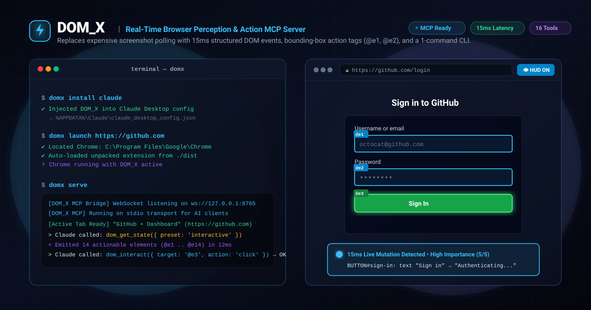

<div align="center">



# ⚡ DOM_X
### *Real-Time Browser Perception & Action MCP Server for AI Agents*

[](https://modelcontextprotocol.io)
[-34d399?style=for-the-badge&logo=vitest&logoColor=white)](https://github.com/mysterious03/DOM_X)
[](https://github.com/mysterious03/DOM_X)
[](https://github.com/mysterious03/DOM_X)
[-f43f5e?style=for-the-badge)](https://github.com/mysterious03/DOM_X)

<br/>

<p align="center">
  <b>DOM_X gives AI assistants (Claude Desktop, Cursor, Antigravity, custom agents) real-time perception and precision action control over live browser tabs—replacing expensive screenshot polling with 15ms structured DOM events, screen bounding boxes, and action tags.</b>
</p>

[The Problem](#-the-problem-in-30-seconds) • [How It Works](#-how-it-works) • [One-Command CLI](#-one-command-cli-suite) • [All 16 MCP Tools](#-all-16-mcp-tools-reference) • [In-Browser HUD](#-in-browser-visual-hud) • [Setup Guides](#-setup-walkthrough)

</div>

---

## ⏱️ The Problem in 30 Seconds

Today's autonomous web agents (built on Playwright, Puppeteer, or Browser-Use) understand browser state by **taking continuous full-page screenshots** and feeding them into Vision Models (GPT-4o, Claude 3.5 Sonnet, Gemini 2.0 Flash):

```
Agent Action ──► 4K Screenshot (5MB) ──► Send to VLM ──► Ask "Did button change?" ──► [Repeat every 500ms]
```

### Why this is broken:
* 🐌 **Extreme Latency:** 2,500ms – 4,000ms round-trip delay per action step.
* 💸 **Runaway Cost:** $0.02 – $0.08 per screenshot inspection ($30–$50 per agent workflow).
* 🔋 **Wasted Compute:** Sending millions of static pixels over the wire to detect a 10-pixel button state flip.
* 👁️ **Blind to Semantic State:** Vision models struggle with invisible states like `aria-expanded="false"`, `disabled`, or off-screen modals.

---

## 💡 The Solution: DOM_X

**DOM_X** connects directly to your live Google Chrome browser via the official **Model Context Protocol (MCP)**:

```
Webpage DOM ──► MutationObserver ──► 96% Noise Filter ──► Bounding Boxes ──► 15ms JSON & Actions (MCP)
```

1. **Token-Efficient Perception:** Extracts clean, structured interactive elements with bounding boxes and action IDs (`@e1`, `@e2`, `@e3`...).
2. **15ms Change-Intelligence:** Informs the AI immediately when a toast appears, modal opens, or form validation fires—without taking screenshots.
3. **Full Precision Action Suite:** The AI can click, hover, type, select dropdowns, send keypresses, scroll, and evaluate scripts directly.
4. **Visual HUD:** Optionally renders live bounding box tags directly in your Chrome window so you can watch what the AI sees in real time.
5. **One-Command CLI:** Installs into Claude Desktop or Cursor and launches Chrome with one command.

---

## 🏗️ Architecture

```
┌─────────────────────────────────────────────────────────────┐
│                 Chrome Browser (Real Websites)              │
│  - Active Tab (Any site: GitHub, Amazon, Wikipedia, etc.)   │
│  - DOM_X Extension: Extracts elements & 15ms DOM events     │
│  - Visual HUD: Renders translucent boxes & @eX badges       │
└──────────────────────────────▲──────────────────────────────┘
                               │ WebSocket (ws://127.0.0.1:8765)
┌──────────────────────────────▼──────────────────────────────┐
│                    DOM_X MCP Server                         │
│  - Implements Model Context Protocol via Stdio transport    │
│  - Translates MCP tool calls into live browser actions      │
│  - CLI Installer, Chrome Auto-Launcher & Diagnostics        │
└──────────────────────────────▲──────────────────────────────┘
                               │ MCP Protocol
┌──────────────────────────────▼──────────────────────────────┐
│           AI Assistant (Claude, Cursor, Antigravity)        │
│  - Invokes: get_page_dom, click_element, type_into_element   │
│  - Waits for DOM mutations (wait_for_dom_change)            │
└─────────────────────────────────────────────────────────────┘
```

---

## 🚀 One-Command CLI Suite

### 1. Build and Link DOM_X
```bash
git clone https://github.com/mysterious03/DOM_X.git
cd DOM_X
npm install
npm run build
npm link
```
> [!NOTE]
> Running `npm link` registers `domx` and `dom-x` globally in your terminal!
> Alternatively, from the repository root you can run: `node ./bin/dom-x.js <command>` or `npm run domx -- <command>`.

---

### 2. Auto-Install into AI Assistants
You don't need to manually edit config files! Let DOM_X automatically detect and inject the MCP configuration:

```bash
# Auto-configure Claude Desktop (claude_desktop_config.json)
domx install claude

# Auto-configure Cursor (mcp.json)
domx install cursor

# Configure both Claude Desktop and Cursor simultaneously
domx install all
```

---

### 3. One-Click Chrome Auto-Launcher
Automatically locate Google Chrome on your system and launch it with the DOM_X extension pre-loaded:

```bash
# Launches Chrome with DOM_X active and opens target URL
domx launch https://github.com
```

---

### 4. Check Diagnostics & System Status
```bash
domx status
```
Output:
```
=== DOM_X System Status ===
Node Version:  v24.19.0
MCP Port:      8765
Root Dir:      C:\Users\ASUS\OneDrive\Desktop\DOM_PULSE
Dist Built:    Yes
MCP Bundle:    Yes
Chrome Found:  C:\Program Files\Google\Chrome\Application\chrome.exe
```

---

### 5. Run MCP Server (Stdio)
```bash
domx serve
# or simply: domx
```
*(Listens on WebSocket `ws://127.0.0.1:8765` for browser tabs and connects to AI clients via stdio JSON-RPC).*

---

## 🛠️ All 16 MCP Tools Reference

DOM_X equips your AI assistant with 16 tools categorized into **Perception**, **Interaction**, and **Automation**:

### 🔍 Perception Tools

#### 1. `get_page_dom`
Inspects the active tab and returns an AI-token-optimized list of actionable elements with bounding boxes and action IDs (`@e1`, `@e2`...).
* **Parameters**:
  * `visibleOnly` *(boolean, default: true)*: Only extract elements currently visible in viewport.
  * `preset` *(string, default: "interactive")*: Choose from `"interactive"` (buttons/inputs/links), `"all"`, `"forms"` (inputs, selects, buttons), `"headings"` (h1..h6).
  * `query` *(string, optional)*: Scopes extraction to a specific CSS selector (e.g., `form.checkout-form` or `#main-content`).
  * `search` *(string, optional)*: Filters elements matching label, name, or tag (e.g. `"Search"` or `"Sign In"`).
  * `format` *(string, default: "summary")*: `"summary"` for token-efficient markdown, or `"json"` for full metadata.
* **Example Output**:
  ```text
  [DOM_X Perception | Page: "Sign in to GitHub" | URL: https://github.com/login | Actionable Elements: 3]
  @e1 [TEXTBOX] "Username or email" (at: 420,220 size: 320x34)
  @e2 [TEXTBOX] "Password" (at: 420,280 size: 320x34)
  @e3 [BUTTON] "Sign in" (at: 420,340 size: 320x36)
  ```

#### 2. `get_dom_mutations`
Retrieves recent meaningful DOM change events (15ms latency) captured by DOM_X (modals opened, toast alerts, cart counter increments, URL navigation, form validation errors).
* **Parameters**:
  * `limit` *(number, default: 20)*: Maximum number of recent events.
  * `clearAfterRead` *(boolean, default: false)*: Clears the event buffer after reading.

#### 3. `wait_for_dom_change`
Asynchronously pauses agent execution until a DOM mutation occurs in the browser. Perfect for awaiting responses after clicking submit buttons.
* **Parameters**:
  * `timeoutMs` *(number, default: 5000)*: Maximum time to wait.
  * `eventType` *(string, optional)*: Wait for a specific event type (e.g. `"DOM_ALERT_APPEARED"`, `"DOM_MODAL_OPENED"`).

#### 4. `inspect_element`
Performs a deep inspection on an element, returning computed styles (color, background, font, display), all attributes, full parent breadcrumbs, and interactivity state.
* **Parameters**:
  * `target` *(string, required)*: Reference ID (e.g. `@e1`) or CSS selector.

#### 5. `get_dom_diff`
Compares the current DOM state against the previous scan and returns added, removed, or modified elements.

#### 6. `get_browser_status`
Checks connection health, active tab URL, page title, and WebSocket port.

---

### 👆 Interaction Tools

#### 7. `click_element`
Clicks an interactive element by reference ID (`@e1`) or CSS selector. Smoothly scrolls the element into view, flashes visual feedback, and dispatches native events.
* **Parameters**: `target: string` (e.g. `"@e1"` or `"#submit-btn"`)

#### 8. `hover_element`
Moves the cursor over an element to reveal hover tooltips, preview dropdown menus, or interactive hover states.
* **Parameters**: `target: string` (e.g. `"@e2"`)

#### 9. `type_into_element`
Enters text into an input field or textarea. Dispatches `input` and `change` events.
* **Parameters**:
  * `target` *(string, required)*: e.g. `"@e1"`
  * `text` *(string, required)*: text to type
  * `clearFirst` *(boolean, default: false)*: clears existing field value first
  * `pressEnter` *(boolean, default: false)*: submits form by dispatching Enter key after typing

#### 10. `select_option`
Selects an option in a `<select>` dropdown by value or visible text.
* **Parameters**:
  * `target` *(string, required)*: e.g. `"@e4"`
  * `valueOrText` *(string, required)*: e.g. `"Canada"` or `"CA"`

#### 11. `press_key`
Sends keyboard key events (e.g. `Enter`, `Escape`, `Tab`, `ArrowDown`, `Backspace`) with modifier keys.
* **Parameters**:
  * `key` *(string, required)*: e.g. `"Enter"`, `"Escape"`, `"Tab"`
  * `target` *(string, optional)*: element ID (defaults to activeElement)
  * `ctrl`, `shift`, `alt`, `meta` *(boolean, optional)*: modifier flags

#### 12. `scroll_page`
Scrolls the viewport or scrolls a specific element into view.
* **Parameters**:
  * `direction` *(string)*: `"up" | "down" | "top" | "bottom" | "element"`
  * `amount` *(number, default: 400)*: pixel distance
  * `target` *(string, optional)*: element ID if direction is `"element"`

#### 13. `highlight_element`
Draws a temporary glowing highlight ring around an element on screen for visual targeting confirmation.
* **Parameters**: `target: string`, `color?: string` (e.g. `"#38bdf8"`)

---

### ⚡ Automation & Scripting Tools

#### 14. `navigate_to`
Directs the browser tab to navigate to any URL.
* **Parameters**: `url: string` (e.g. `"https://github.com"`)

#### 15. `eval_script`
Safely evaluates arbitrary JavaScript expressions inside the active tab context and returns the result to the AI.
* **Parameters**: `expression: string` (e.g. `"window.location.pathname"` or `"document.title"`)

#### 16. `toggle_visual_hud`
Toggles the real-time visual bounding box overlay in Chrome on or off.
* **Parameters**: `enabled: boolean`

---

## 👁️ In-Browser Visual HUD

DOM_X includes a real-time visual perception overlay built directly into the Chrome extension:
- Click the DOM_X extension icon in Chrome and click **`👁️ HUD`**.
- All interactive elements are outlined with glowing cyan/green bounding boxes and tagged with `@e1`, `@e2`, `@e3`...
- When the AI performs actions or DOM mutations occur, elements pulse with live visual feedback.

---

## 📖 Manual Configuration

If you prefer manual configuration over `domx install`:

### Claude Desktop (`claude_desktop_config.json`)
- **Windows**: `%APPDATA%\Claude\claude_desktop_config.json`
- **macOS**: `~/Library/Application Support/Claude/claude_desktop_config.json`

```json
{
  "mcpServers": {
    "dom-x": {
      "command": "node",
      "args": [
        "c:/Users/ASUS/OneDrive/Desktop/DOM_PULSE/dist/mcp/index.js"
      ]
    }
  }
}
```

### Cursor (`mcp.json`)
```json
{
  "mcpServers": {
    "dom-x": {
      "command": "node",
      "args": [
        "c:/Users/ASUS/OneDrive/Desktop/DOM_PULSE/dist/mcp/index.js"
      ]
    }
  }
}
```

---

## 🧪 Testing

Run the automated test suite:
```bash
npm test
```
All **47 unit and integration tests** pass locally with 100% pass rate.

---

## 📄 License

MIT License.
